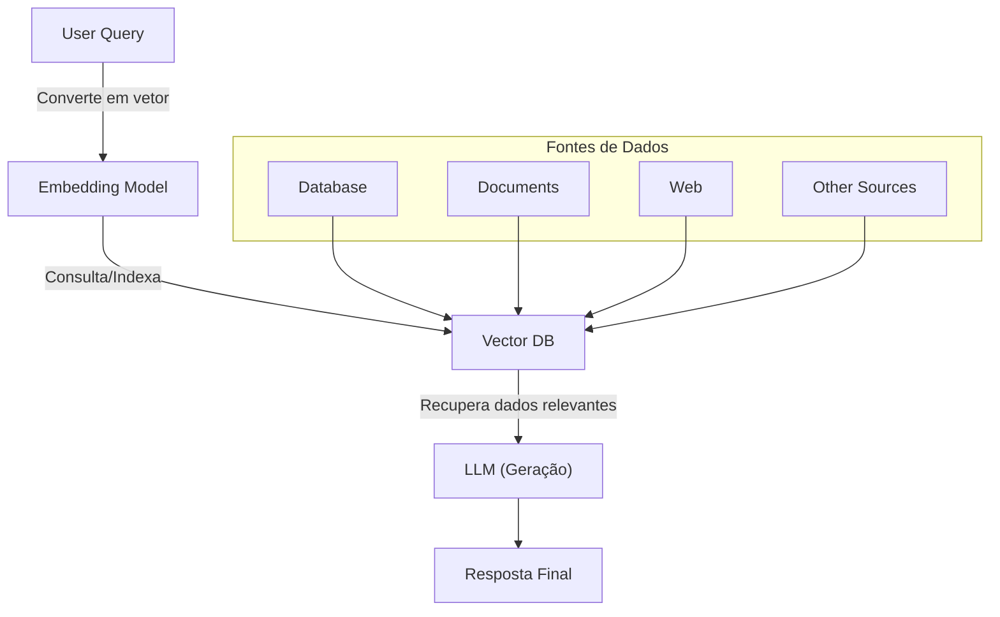

# Nível 3 - Otimizando LLMs com RAG

> Retornar ao [README.md](../../../README.md)

## Sumário

- [Nível 3 - Otimizando LLMs com RAG](#nível-3---otimizando-llms-com-rag)
  - [Sumário](#sumário)
  - [Estrutura de Pastas e Arquivos](#estrutura-de-pastas-e-arquivos)
  - [Notas e Links Importantes](#notas-e-links-importantes)
  - [Questionário Avaliativo](#questionário-avaliativo)
  - [Conceitos e Explicações](#conceitos-e-explicações)
    - [O que são LLMs?](#o-que-são-llms)
      - [Pricipais LLMs existentes no mercado](#pricipais-llms-existentes-no-mercado)
    - [Limitações dos LLMs](#limitações-dos-llms)
    - [Limitações de prompts com contexto para as LLMs](#limitações-de-prompts-com-contexto-para-as-llms)
    - [O que é RAG?](#o-que-é-rag)
      - [Benefícios do RAG](#benefícios-do-rag)
    - [Ferramentas RAG disponíveis no mercado](#ferramentas-rag-disponíveis-no-mercado)
    - [RAG OpenAI](#rag-openai)
    - [Componentes do RAG](#componentes-do-rag)
      - [1. Dados](#1-dados)
      - [2. Tecnologias](#2-tecnologias)
        - [2.1 Embedding Model](#21-embedding-model)
        - [2.2 Vector DB](#22-vector-db)
        - [2.3 LLM (Large Language Model)](#23-llm-large-language-model)
        - [3. Pipeline de Funcionamento](#3-pipeline-de-funcionamento)
      - [Resumo da Arquitetura](#resumo-da-arquitetura)
    - [O que é Langchain?](#o-que-é-langchain)
      - [Principais Recursos](#principais-recursos)
      - [Como Funciona?](#como-funciona)
      - [Casos de Uso](#casos-de-uso)
      - [Integrações](#integrações)
      - [Conclusão](#conclusão)
    - [Exemplo de Arquitetura RAG Simples](#exemplo-de-arquitetura-rag-simples)

## Estrutura de Pastas e Arquivos

```plaintext
📁 n3
├─📁m1 (RAG documentos PDF)
│ └─📓[solucao_rag.ipynb]  
├─📁m2 (RAG Code Review)
│ └─📓[code-review_rag.ipynb]
├─📁m3 (Advanced RAG)
│ ├─📄[DOC-SF238339076816-20230503.pdf]
│ ├─📓[parent_rag.ipynb]
│ └─📓[rerank_rag.ipynb]
├─📁m4 (Deply RAG)
│ ├─📄[DOC-SF238339076816-20230503.pdf]
│ ├─🐳[Dockerfile]
│ ├─📄[requirements.txt]
│ └─🐍[simple_rag.py]
└─📁task
  ├─📄[os-sertões.pdf]
  ├─📓[t_naive_rag.ipynb]
  ├─📓[t_parent_rag.ipynb]
  └─📓[t_rerank_rag.ipynb]
```

## Notas e Links Importantes

- [AskyourPDF](https://askyourpdf.com/) - RAG gratuito com limitação mediante criação de conta.
- [Chatbase](https://www.chatbase.co/) - RAG gratuito com limitação mediante criação de conta.

## Questionário Avaliativo

1. *O que é RAG (Retrieval Augmented Generation)?* **Resposta:** Uma abordagem que combina a recuperação de informações de fontes externas com a geração de texto por modelos de linguagem.

2. *Qual das listagens abaixo representa os principais componentes do RAG* **Resposta:** Dados, LLM, Embedding Model, Vector DB

3. *Considerando as possíveis fontes de dados para aplicação de RAG junto a um LLM, quais afirmativas estão corretas? I-Podem ser utilizadas tanto imagens quanto textos formatados. II-Resultados de APIs de outras aplicações podem ser aplicados. III-Os modelos de LLM entendem textos no seu formato "natural", assim como seres humanos. IV-Normalmente, novas informações são tratadas e salvas em bancos de dados vetoriais.* **Resposta:** I, II e IV

4. *O que significa "Relevant Chunk" no contexto de modelos de linguagem e IA?* **Resposta:** Um fragmento específico de informações altamente relevantes para uma consulta, extraído para auxiliar na geração de respostas.

5. *Qual dos seguintes elementos são desafios para arquitetura simples de RAG. I-Determinar um valor bem ajustado para Chunk size e Top K para determinado tema. II-Modelo LLM dar muito foco ao documento recuperado, o que pode ocasionar erros caso o documento não possua informações realmente relevantes. III-Podem ocorrer perdas de informações por diversas razões, seja por configuração de de Cunk size e Top K ou mesmo por erro na recuperação de informação.* **Resposta:** I, II e III

6. *Considerando a explicação sobre Parent Document Retriever qual das afirmações melhor descreve a técnica.* **Resposta:** Ela se baseia em usar Chunks menores para precisão e Chunks maiores para definir o contexto

7. *Para se fazer um bom Rerank é utilizada a técnica de Cross-Encoder, quais das descrições abaixo melhor define o que é um Cross-Encoder:* **Resposta:** Um Cross-Encoder é uma técnica que avalia pares de entrada (como uma consulta e um documento) simultaneamente, concatenando-os e alimentando-os em um modelo como uma rede neural. Ele atribui uma única pontuação de relevância para o par, sendo eficaz para tarefas de rerank devido à sua capacidade de capturar interações detalhadas entre os pares.

## Conceitos e Explicações

> [Slides](../pdf/n3.pdf) das aulas
>
> [Desafio e Soluções](../content/tasks/cn3.md)

### O que são LLMs?

LLMs, ou Modelos de Linguagem de Grande Escala, são sistemas de inteligência artificial que utilizam redes neurais profundas para entender, gerar e interagir com a linguagem humana. Eles são treinados com grandes volumes de dados textuais e empregam arquiteturas avançadas, como os transformadores, para capturar padrões e contextos na linguagem. Com isso, esses modelos conseguem realizar diversas tarefas, como tradução, resumo de textos, resposta a perguntas e até a criação de conteúdos originais.

#### Pricipais LLMs existentes no mercado

1. **GPT-4 (OpenAI):**  
   Um dos modelos mais avançados, utilizado para diversas tarefas que vão desde a criação de texto até a compreensão contextual complexa.

2. **GPT-3 (OpenAI):**  
   Antecessor do GPT-4, amplamente empregado em aplicações comerciais e acadêmicas, oferecendo uma vasta gama de funcionalidades linguísticas.

3. **PaLM 2 (Google):**  
   Uma evolução dos modelos de linguagem do Google, focado em melhorar a compreensão e geração de texto para diversas tarefas.

4. **LaMDA (Google):**  
   Especializado em diálogos e conversas, este modelo foi projetado para interações mais naturais e contextuais.

5. **LLaMA (Meta):**  
   Modelo lançado pela Meta, conhecido por seu equilíbrio entre performance e eficiência, adequado para pesquisas e aplicações práticas.

6. **OPT (Meta):**  
   Desenvolvido com foco em transparência, o OPT é um modelo de linguagem de código aberto que permite experimentação e pesquisa.

7. **Claude (Anthropic):**  
   Projetado com ênfase em segurança e alinhamento ético, esse modelo visa fornecer respostas mais confiáveis e controladas.

8. **BLOOM (BigScience):**  
   Um modelo multilíngue que resulta de um esforço colaborativo internacional, capaz de trabalhar com diversos idiomas e contextos.

9. **Jurassic-1 (AI21 Labs):**  
   Destinado à criação de conteúdo e suporte a aplicações linguísticas, oferece alta qualidade na geração de textos.

10. **MPT (MosaicML):**  
    Modelo focado em eficiência e flexibilidade, permitindo adaptações para diferentes casos de uso e integração em soluções empresariais.

Cada um desses modelos possui características únicas e é direcionado para diferentes aplicações dentro do campo de inteligência artificial e processamento de linguagem natural.

---

### Limitações dos LLMs

1. **Compreensão Contextual Limitada:**  
   Embora sejam muito eficazes em identificar padrões na linguagem, esses modelos operam com base em correlações estatísticas dos dados de treinamento e podem não compreender nuances ou contextos complexos da mesma forma que um ser humano.

2. **Alucinações e Respostas Incorretas:**  
   Eles podem gerar informações plausíveis, mas imprecisas ou mesmo erradas, conhecidas como "alucinações". Isso ocorre porque o modelo tenta compor uma resposta com base em padrões, mesmo quando não tem dados suficientes para uma resposta totalmente precisa.

3. **Dependência dos Dados de Treinamento:**  
   A qualidade e a atualidade das respostas estão diretamente ligadas aos dados com os quais foram treinados. Assim, se os dados forem desatualizados ou possuírem vieses, o modelo pode refletir essas limitações.

4. **Capacidade de Raciocínio Limitada:**  
   Apesar de poder simular processos de raciocínio, LLMs não possuem uma compreensão real do mundo. Isso pode levá-los a dificuldades em resolver problemas que exigem raciocínio lógico profundo ou entendimento de contextos que não foram bem representados durante o treinamento.

5. **Janela de Contexto Fixa:**  
   Há um limite na quantidade de texto que o modelo consegue processar de uma só vez (a janela de contexto). Em diálogos muito longos ou textos extensos, o modelo pode "esquecer" informações importantes mencionadas anteriormente.

6. **Sensibilidade à Formulação da Pergunta:**  
   A forma como uma pergunta é formulada pode impactar significativamente a resposta gerada. Pequenas variações podem levar a respostas diferentes, o que pode ser desafiador para a consistência.

7. **Ausência de Consciência e Emoção:**  
   LLMs não possuem emoções, autoconsciência ou compreensão subjetiva. Eles simplesmente processam dados e geram respostas com base em padrões, sem uma compreensão real dos sentimentos ou intenções por trás das palavras.

Essas limitações ressaltam a importância de usar LLMs como ferramentas auxiliares, sempre acompanhadas de uma verificação crítica por parte de humanos.

### Limitações de prompts com contexto para as LLMs

Os prompts com contexto são uma ferramenta poderosa para direcionar a resposta das LLMs, mas possuem limitações importantes, como:

- **Limite da Janela de Contexto:**  
  Cada modelo tem um número máximo de tokens que pode processar. Se o prompt ultrapassar esse limite, partes importantes podem ser truncadas ou esquecidas.

- **Complexidade e Estruturação:**  
  Prompts muito extensos ou mal organizados podem confundir o modelo, fazendo com que ele não consiga identificar qual parte do contexto é mais relevante para a resposta.

- **Sensibilidade à Formatação:**  
  A forma como as informações são apresentadas (ordem, pontuação, separação de tópicos) pode afetar a interpretação do modelo, podendo levar a respostas imprecisas ou fora do esperado.

- **Ambiguidade e Redundância:**  
  Incluir informações redundantes ou conflitantes pode dificultar a inferência correta da intenção, resultando em respostas inconsistentes.

- **Memória de Curto Prazo:**  
  Mesmo que um prompt contenha muito contexto, o modelo não retém informações além da janela de contexto atual. Em interações longas ou multi-turnos, informações anteriores podem ser perdidas.

- **Alucinações e Invenções:**  
  Apesar do contexto fornecido, o modelo pode gerar informações “alucinadas” — isto é, criar detalhes que não estão presentes no prompt, baseando-se em padrões aprendidos.

- **Dependência dos Dados de Treinamento:**  
  Se o prompt abordar temas ou contextos pouco representados no treinamento do modelo, as respostas podem ser menos precisas ou até enviesadas.

- **Dificuldade com Instruções Complexas:**  
  Quando o prompt tenta abarcar múltiplos objetivos ou temas simultâneos, o modelo pode ter dificuldade em priorizar ou combinar as informações de maneira coerente.

- **Risco de Viés:**  
  Informações ou termos carregados de vieses presentes nos dados de treinamento podem ser reforçados, especialmente se não forem adequadamente contextualizados.

- **Interpretação de Intenções Sutis:**  
  Prompts que dependem de inferências ou nuances sutis podem ser interpretados de forma literal, limitando a capacidade do modelo de captar a intenção completa do usuário.

Essas limitações ressaltam a importância de estruturar cuidadosamente os prompts e, quando necessário, ajustar ou dividir o contexto para obter respostas mais precisas e relevantes.

---

### O que é RAG?

RAG, ou **Retrieval-Augmented Generation**, é uma abordagem que integra duas etapas fundamentais:

1. **Recuperação de Informações (Retrieval):**  
   Antes de gerar uma resposta, o sistema busca em bases de dados, documentos ou até na web informações relevantes que possam complementar o conhecimento do modelo. Essa etapa garante que a resposta possa incorporar dados atualizados e específicos.

2. **Geração de Linguagem (Generation):**  
   O modelo de linguagem utiliza, então, essas informações recuperadas juntamente com o prompt original para gerar uma resposta mais precisa e contextualizada. Isso ajuda a reduzir o risco de "alucinações" – quando o modelo inventa detalhes sem base factual.

#### Benefícios do RAG

- **Acurácia e Atualização:** Permite que os modelos forneçam respostas com dados mais atuais, superando limitações dos conhecimentos pré-treinados.  
- **Contextualização:** Ao integrar informações externas, o modelo melhora sua capacidade de contextualizar a resposta de acordo com o cenário específico da consulta.  
- **Redução de Alucinações:** Com acesso a fontes externas, diminui a chance de gerar informações incorretas ou imprecisas.

Essa abordagem é especialmente útil em tarefas de perguntas e respostas, onde a precisão dos dados é crucial, e vem sendo explorada em diversas aplicações de inteligência artificial para aprimorar a confiabilidade das respostas geradas.

### Ferramentas RAG disponíveis no mercado

No contexto de RAG (Retrieval-Augmented Generation), diversas ferramentas e frameworks vêm facilitando a integração entre recuperação de informações e geração de texto. Essas soluções ajudam a construir pipelines que combinam a busca em bases de dados (seja por meio de mecanismos tradicionais ou de bancos de dados vetoriais) com a capacidade de geração de linguagem dos LLMs. Entre as principais ferramentas disponíveis no mercado, destacam-se:

- **Chatbase:**  
  É uma plataforma que permite criar chatbots customizados utilizando seus próprios dados. O sistema integra uma camada de recuperação de informações – que busca dados relevantes (por exemplo, FAQs, documentos ou logs) – com a geração de respostas por meio de modelos de linguagem. Essa combinação possibilita que o chatbot forneça respostas mais precisas e contextualizadas, seguindo a abordagem RAG.

- **AskYourPDF:**  
  Essa ferramenta é voltada para a interação com documentos PDF. Ao enviar um PDF, o usuário pode fazer perguntas sobre o conteúdo do documento, e o sistema recupera as partes mais relevantes para alimentar o modelo de linguagem e gerar respostas baseadas nesse conteúdo. Assim, ela facilita a consulta e interpretação de informações presentes em PDFs extensos.

- **LangChain:**  
  Um framework open source que facilita a construção de aplicações RAG, integrando modelos de linguagem com diversas fontes de dados e APIs.

- **Haystack (de deepset):**  
  Focado em aplicações de pesquisa e perguntas e respostas, o Haystack permite a criação de pipelines que combinam mecanismos de recuperação (como Elasticsearch ou bancos de dados vetoriais) com modelos de linguagem.

- **LlamaIndex (anteriormente GPT Index):**  
  Essa ferramenta permite indexar dados de diversas fontes e conectar essas informações a LLMs, facilitando a construção de soluções RAG.

- **Bancos de Dados Vetoriais (Pinecone, Weaviate, Milvus, Qdrant):**  
  Essenciais para realizar buscas semânticas, esses bancos armazenam embeddings de texto que possibilitam recuperar informações relevantes de forma rápida e precisa para alimentar os modelos de geração.

- **Elasticsearch:**  
  Embora não seja um banco de dados vetorial por natureza, é amplamente utilizado para busca textual e pode ser integrado em pipelines RAG para complementar a recuperação de informações.

- **Microsoft Semantic Kernel:**  
  Uma ferramenta emergente que auxilia na integração entre processamento de linguagem natural e técnicas de recuperação, contribuindo para a construção de sistemas RAG mais robustos.

Essas ferramentas se complementam e podem ser combinadas de diferentes maneiras, dependendo do caso de uso e dos requisitos da aplicação, permitindo que os sistemas RAG se beneficiem tanto do conhecimento dos LLMs quanto da atualização e especificidade dos dados recuperados.

---

### RAG OpenAI

No contexto da OpenAI, a abordagem RAG (Retrieval-Augmented Generation) não é apresentada como um produto autônomo, mas seus modelos—como o GPT-3 e o GPT-4—são frequentemente integrados em sistemas que utilizam essa técnica. A seguir, alguns pontos relevantes sobre como a OpenAI se relaciona com o RAG:

1. **Integração com APIs e Geração de Embeddings:**  
   A OpenAI oferece APIs que possibilitam a criação de embeddings a partir de textos. Esses embeddings podem ser usados para indexação e recuperação semântica, componentes essenciais para montar um pipeline RAG. Assim, desenvolvedores podem construir sistemas que, ao receber uma consulta, buscam informações relevantes em bases de dados e depois utilizam os modelos generativos da OpenAI para formular uma resposta informada.

2. **Mitigação de Alucinações:**  
   Uma das vantagens de incorporar uma etapa de recuperação de informações é reduzir o risco de alucinações. Ao ancorar a geração de respostas em dados recuperados, os sistemas RAG podem oferecer respostas mais precisas e factuais, complementando a capacidade dos LLMs da OpenAI.

3. **Aplicações Diversificadas:**  
   Essa integração é amplamente explorada em aplicações como assistentes virtuais, chatbots especializados, sistemas de perguntas e respostas e suporte ao cliente. O uso de RAG permite que os sistemas ofereçam informações atualizadas e contextuais, o que é particularmente valioso em domínios específicos ou com bases de conhecimento dinâmicas.

4. **Flexibilidade e Customização:**  
   Embora a técnica RAG tenha sido popularizada por outros estudos e organizações, a robustez dos modelos da OpenAI permite que desenvolvedores combinem esses modelos com diversas ferramentas de recuperação—como bancos de dados vetoriais (ex.: Pinecone, Weaviate, Milvus) e motores de busca tradicionais—para criar soluções customizadas que atendam às necessidades específicas de cada aplicação.

5. **Inovação e Convergência de Tecnologias:**  
   Mesmo que a OpenAI não rotule suas soluções diretamente como “RAG”, a combinação de suas tecnologias com mecanismos de recuperação de dados tem impulsionado inovações significativas no campo de sistemas conversacionais e de suporte, permitindo que as respostas geradas sejam mais robustas e contextualizadas.

Em resumo, a OpenAI fornece as bases (através de seus modelos de linguagem e APIs de embeddings) para que desenvolvedores possam construir sistemas RAG, os quais melhoram a precisão e relevância das respostas ao incorporar informações externas e atualizadas ao processo de geração.

---

### Componentes do RAG

O RAG é uma abordagem que combina modelos de geração de linguagem (LLM) com recuperação de informações em tempo real para fornecer respostas mais precisas e atualizadas. A arquitetura pode ser dividida em dois blocos principais: **Recuperação (Retrieval)** e **Geração (Generation)**.

#### 1. Dados

Os dados são a base para a recuperação de informações e podem vir de diversas fontes:

- **Database**: Bancos de dados estruturados (SQL, NoSQL).
- **Document**: Arquivos como PDFs, documentos de texto, planilhas.
- **Web**: Conteúdo da web, APIs ou artigos online.
- **Other Sources**: Dados não estruturados, logs, repositórios internos ou serviços de armazenamento em nuvem.

---

#### 2. Tecnologias

##### 2.1 Embedding Model

O **modelo de embeddings** transforma os textos em vetores numéricos, que representam o significado semântico das palavras ou sentenças.

- Exemplos: `OpenAI Embeddings`, `Sentence-BERT`, `Hugging Face Transformers`.
- Função: Criar representações vetoriais para facilitar a busca semântica.

##### 2.2 Vector DB

O **banco de dados vetorial** armazena e indexa os vetores gerados pelo modelo de embeddings, permitindo a busca por similaridade.

- Exemplos: `FAISS`, `Pinecone`, `Weaviate`, `Milvus`.
- Função: Recuperar os vetores mais semelhantes com base em uma consulta.

##### 2.3 LLM (Large Language Model)

O **modelo de linguagem** é responsável pela geração da resposta final com base nas informações recuperadas.

- Exemplos: `ChatGPT`, `LLaMA`, `PaLM`.
- Função: Gerar respostas naturais e coerentes usando o contexto obtido.

##### 3. Pipeline de Funcionamento

1. **Consulta (Query)**: O usuário faz uma pergunta.
2. **Embedding**: A pergunta é convertida em vetor pelo modelo de embeddings.
3. **Busca**: O vetor da pergunta é usado para buscar documentos relevantes no Vector DB.
4. **Recuperação**: Os documentos mais relevantes são retornados.
5. **Geração**: O LLM utiliza os documentos recuperados para gerar uma resposta informada.

#### Resumo da Arquitetura

| Componente       | Função                       | Exemplos             |
|----------------|-----------------------------|--------------------|
| Database       | Armazenar dados estruturados | MySQL, MongoDB     |
| Document      | Armazenar dados não estruturados | PDFs, TXT         |
| Web           | Fonte de dados online        | APIs, Sites       |
| Embedding Model | Converter texto em vetores    | Sentence-BERT, OpenAI |
| Vector DB     | Indexar e buscar vetores     | FAISS, Pinecone   |
| LLM           | Gerar respostas             | ChatGPT, LLaMA    |

Essa arquitetura torna o RAG uma solução poderosa para sistemas de busca inteligente e chatbots baseados em conhecimento.

---

### O que é Langchain?

**LangChain** é uma estrutura de desenvolvimento projetada para facilitar a criação de aplicações baseadas em modelos de linguagem (LLMs — *Large Language Models*). Ele oferece ferramentas para integrar LLMs a diferentes fluxos de trabalho, permitindo a construção de aplicações mais complexas e dinâmicas, como:

- Chatbots inteligentes
- Sistemas de geração de conteúdo
- Resumos automáticos de texto
- Análise de documentos
- Agentes autônomos

#### Principais Recursos

1. **Chains**: Permite encadear múltiplas chamadas de modelos de linguagem e outras operações em uma única sequência lógica.
2. **Agents**: Criação de agentes autônomos que interagem com ferramentas externas para tomar decisões com base na entrada do usuário.
3. **Memory**: Persistência de contexto em conversas, permitindo diálogos mais naturais.
4. **Tools**: Conexão com APIs externas, bancos de dados, e ferramentas de busca para enriquecer as respostas.
5. **Prompt Templates**: Criação de prompts dinâmicos e reutilizáveis para personalizar a entrada nos modelos.
6. **Document Loaders e Indexes**: Carregamento e processamento de documentos para busca semântica e recuperação de informações.

#### Como Funciona?

A arquitetura do LangChain é modular, o que facilita a integração com diversas tecnologias. Um exemplo básico de uso seria:

```python
from langchain import PromptTemplate, LLMChain
from langchain.llms import OpenAI

# Configuração do modelo
llm = OpenAI(api_key="sua_api")

# Definição do template de prompt
template = PromptTemplate(input_variables=["nome"], template="Qual é a origem do nome {nome}?")

# Criação da cadeia
chain = LLMChain(llm=llm, prompt=template)

# Execução
resposta = chain.run("ChatGPT")
print(resposta)
```

#### Casos de Uso

- Atendimento ao cliente automatizado
- Assistentes virtuais
- Recuperação de informações em bases de dados
- Tradução automática
- Geração de relatórios

#### Integrações

O LangChain suporta múltiplos provedores de LLM, como:

- OpenAI
- Hugging Face
- Google Vertex AI
- Azure OpenAI

Além disso, pode ser integrado a bibliotecas como **FAISS** e **Chroma** para vetorização e busca semântica.

#### Conclusão

O LangChain é uma estrutura poderosa para criar aplicações que combinam modelos de linguagem com ferramentas externas. Sua abordagem modular e suporte a múltiplos provedores tornam a criação de soluções baseadas em IA mais acessível e eficiente.

### Exemplo de Arquitetura RAG Simples

Abaixo está uma ilustração simples de uma arquitetura RAG, que integra diversas fontes de dados com os componentes tecnológicos responsáveis por transformar, indexar e gerar a resposta final:



> **Legenda:**
>
> - **Fontes de Dados:** Incluem Database, Documents, Web e Other Sources.
> - **Embedding Model:** Converte a consulta (e os dados) em representações vetoriais.
> - **Vector DB:** Armazena e indexa esses vetores para busca por similaridade.
> - **LLM (Geração):** Utiliza as informações recuperadas para gerar a resposta final.
